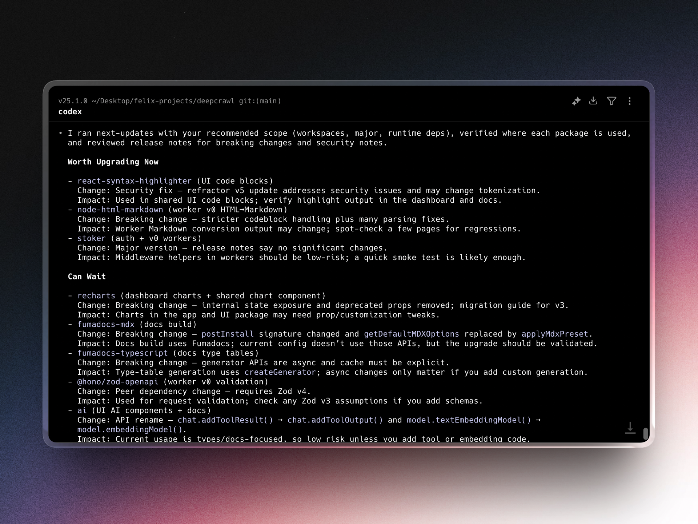

# You can use this one prompt to make your agent tells you what to upgrade and why in your current repo

Copy and paste this prompt into your favorite coding agent (Cursor, Codex, Claude Code):

> `use npx next-updates to help me upgrade my deps`

Then it will scan and tell you what to upgrade in your current repo, based on what you are building.



Philosophy:

- Agent-first: your coding agent runs this, not you.
- Zero install: use `npx` and go, no setup.
- Agent-as-skill: like Claude skills, but prebuilt for any agent.
- Evidence-first: rely on release notes/changelogs, not guesses.
- Safe by default: never changes code unless asked.

Usage:

```bash
npx next-updates
npx next-updates -i
```

Flags:
`--scope` `--target` `--dep` `--risk` `--output` `--debug-dump`

Works with npm, pnpm, Yarn, and Bun lockfiles.

Local dev:

```bash
pnpm install
pnpm build
node dist/bin.mjs
```

MIT License. See `LICENSE`.
